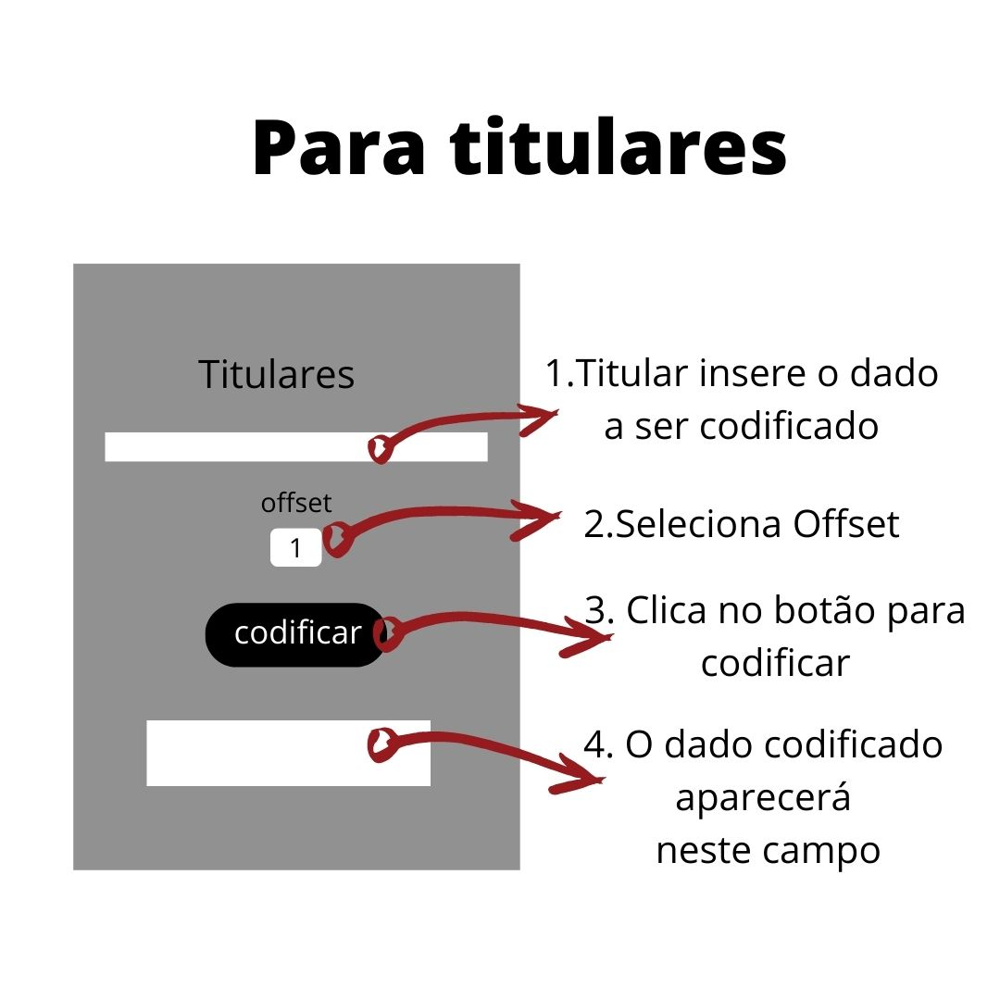
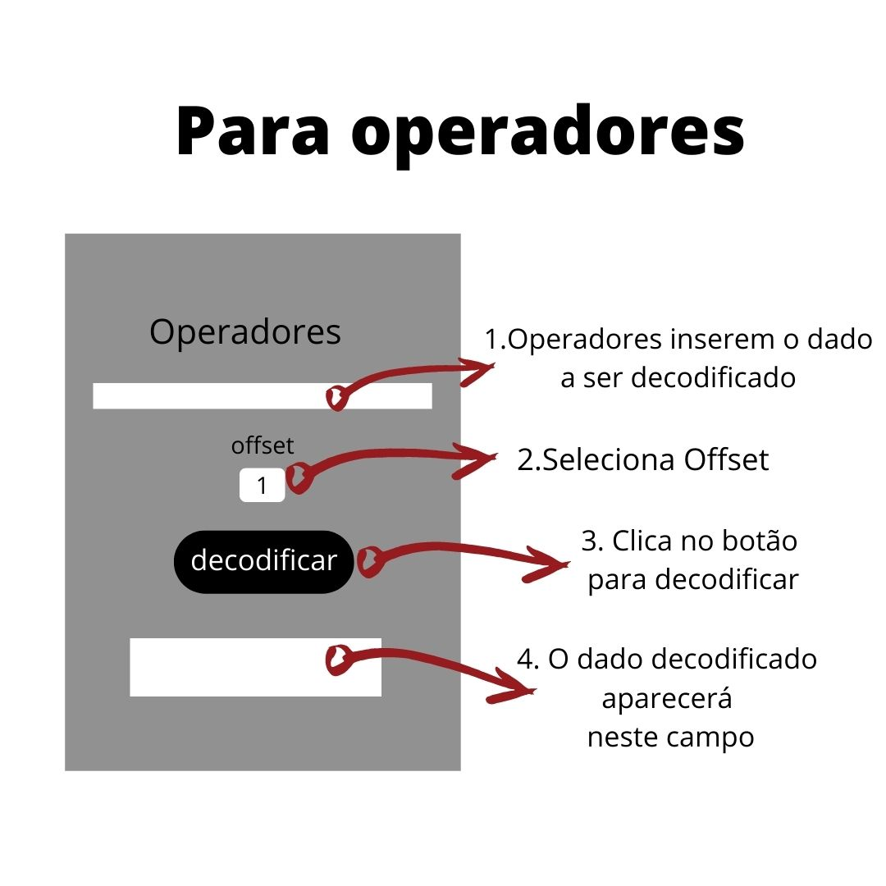

# Sistema de Proteção de Dados

## Índice

* [1. Introdução](#1-Introdução)
* [2. Resumo do projeto](#2-resumo-do-projeto)
* [3. Processo de Desenvolvimento da Aplicação](#3-processo-de-desenvolvimento-da-aplicação)
* [4. Protótipo](#prototipo)

***

## 1. Introdução

O Sistema de Proteção de Dados é uma aplicação que tem como finalidade proteger informações que circulam em empresas, tendo como base a [Lei Geral de Proteção de Dados Pessoais](http://www.planalto.gov.br/ccivil_03/_ato2015-2018/2018/lei/l13709.htm) (LGPD). Esta, que entrou em vigor em setembro de 2020, estabelece regras sobre o armazenamento de dados pessoais de forma segura pelas empresas e organizações, de forma que não sejam difundidos em outros meios. 

São quatro os atores envolvidos no processo de coleta de dados: o titular (o indivíduo a quem pertence os dados pessoais), o controlador (empresa ou indivíduo que coleta esses dados), o operador (indivíduo ou empresa que trata os dados, com autorização do controlador) e o encarregado (indivíduo indicado pelo controlador e que atua como intermediário na comunicação entre os atores(controlador, os titulares e a autoridade nacional).

## 2. Resumo do projeto

A aplicação foi desenvolvida para um projeto da Laboratória- BR, onde foi proposto desenvolver por meio de uma aplicação Web, um programa que permita codificar e decodificar mensagens, tendo por base a [Cifra de César](https://pt.wikipedia.org/wiki/Cifra_de_C%C3%A9sar). No programa, o usuário insere a mensagem, informa a chave (offset) de deslocamento das letras para cifrar ou decifrar os dados inseridos.

Nesse sentido, o Sistema de Proteção de Dados visa proteger os dados informados pelo Titular por meio de codificação das informações inseridas no sistema de uma Empresa e essas informações só podem ser decodificadas e tratadas pelo Operador, com autorização do Controlador.

## 3. Processo de Desenvolvimento da Aplicação

- Pesquisa exploratória sobre o tema da Aplicação;
- Definição do usuário;
- Desenvolvimento da Interface (HTML - CSS);
- Desenvolvimento da lógica do programa;
- Testar a solução.

### Protótipo

Neste primeiro momento, o protótipo da aplicação permitirá ao Titular inserir seus dados, ele informará ao Controlador a mensagem codificada e o offset e este passará esses dados ao Operador para que os dados sejam tratados.

#### Fluxo do programa:

